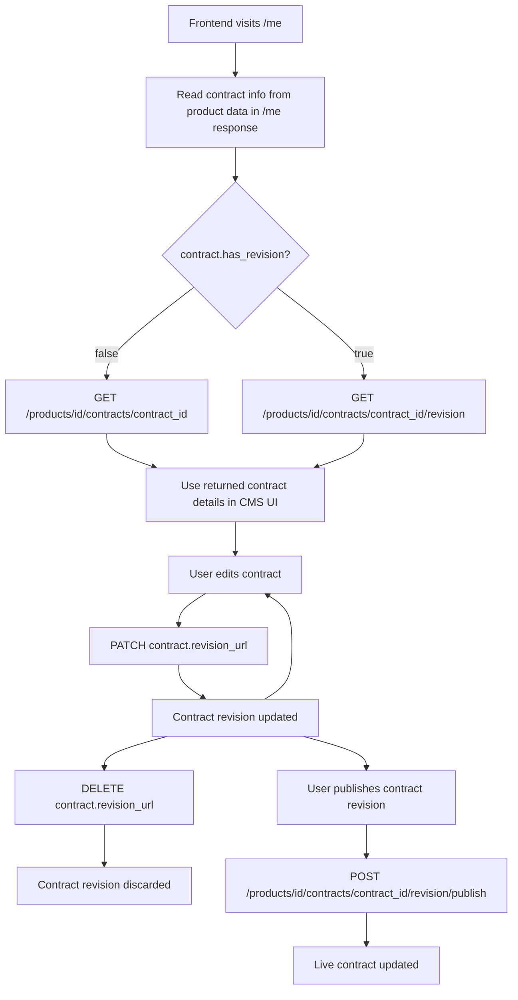

# Frontend Contract Revision Workflow

```mermaid
flowchart TD
    A[Frontend visits /me] --> B[Read contract info from product data in /me response]
    B --> C{contract.has_revision?}

    C -- false --> D[GET /products/id/contracts/contract_id]
    C -- true --> E[GET /products/id/contracts/contract_id/revision]

    D --> F[Use returned contract details in CMS UI]
    E --> F

    F --> G[User edits contract]
    G --> H[PATCH contract.revision_url]
    H --> I[Contract revision updated]

    I --> G
    I --> M[DELETE contract.revision_url]
    M --> N[Contract revision discarded]

    I --> J[User publishes contract revision]
    J --> K[POST /products/id/contracts/contract_id/revision/publish]
    K --> L[Live contract updated]
```
