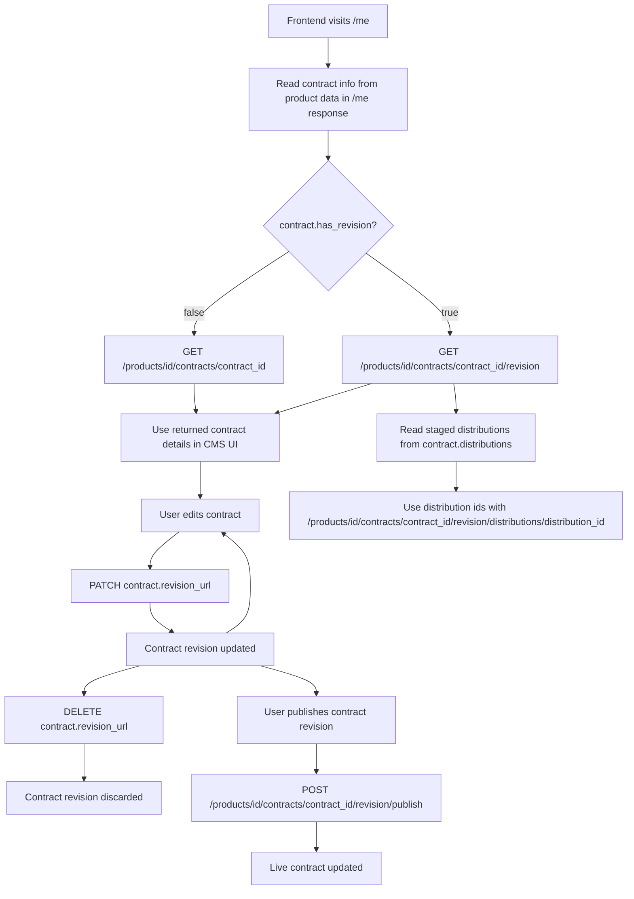

# Frontend Contract Revision Workflow

When the frontend loads the explicit contract revision endpoint, the response includes the staged
`distributions` collection. Use the returned distribution ids with the parent revision namespace
under
`/products/{product_id}/contracts/{contract_id}/revision/distributions/{distribution_id}` for
child draft detail and mutation. Live distribution detail responses keep using
`/products/{product_id}/contracts/{contract_id}/distributions/{distribution_id}` and expose
`has_revision` plus `revision_url` when a staged draft exists.
