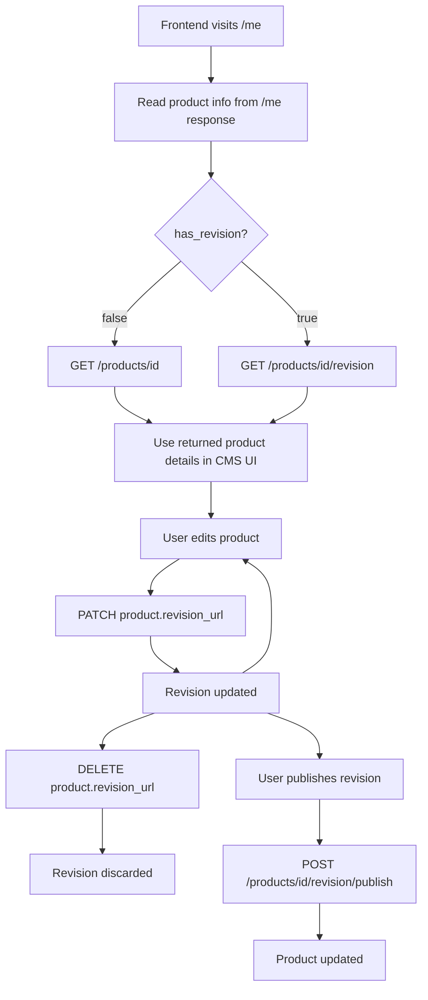

# Frontend Product Revision Workflow

```mermaid
flowchart TD
    A[Frontend visits /me] --> B[Read product info from /me response]
    B --> C{has_revision?}

    C -- false --> D[GET /products/id]
    C -- true --> E[GET /products/id/revision]

    D --> F[Use returned product details in CMS UI]
    E --> F

    F --> G[User edits product]
    G --> H[PATCH product.revision_url]
    H --> I[Revision updated]

    I --> G
    I --> M[DELETE product.revision_url]
    M --> N[Revision discarded]

    I --> J[User publishes revision]
    J --> K[POST /products/id/revision/publish]
    K --> L[Product updated]
```
