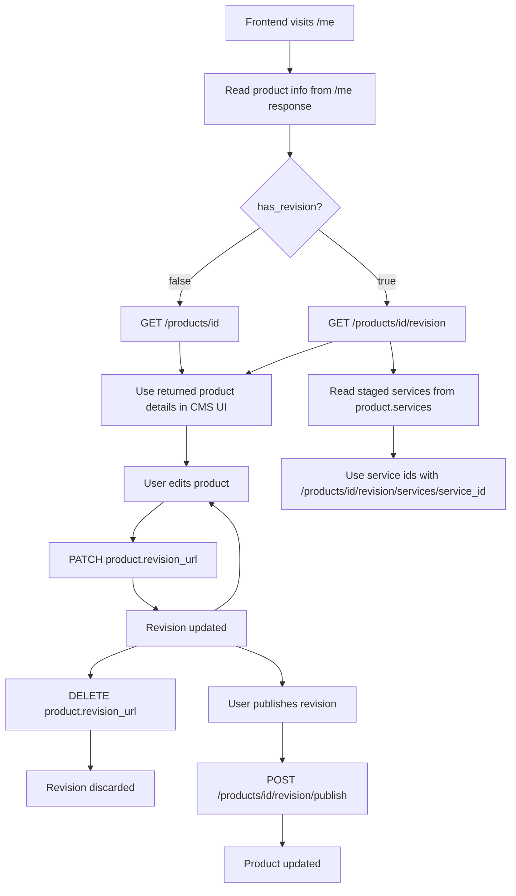

# Frontend Product Revision Workflow

When the frontend loads the explicit product revision endpoint, the response includes the staged
`services` collection. Use the returned service ids with the parent revision namespace under
`/products/{product_id}/revision/services/{service_id}` for child draft detail and mutation.
Live service detail responses keep using `/products/{product_id}/services/{service_id}` and expose
`has_revision` plus `revision_url` when a staged draft exists.
